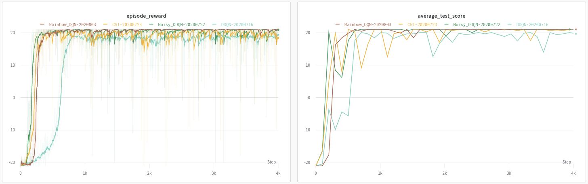
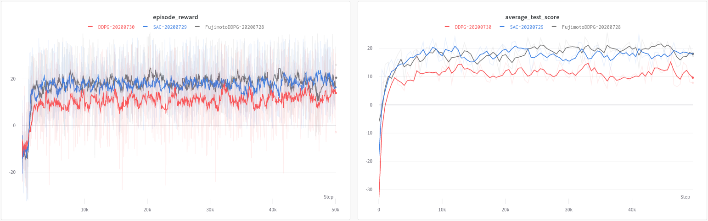

# RLcycle

[](https://opensource.org/licenses/MIT)
<!-- [](https://lgtm.com/projects/g/cyoon1729/RLcycle/context:python) -->
[](https://github.com/ambv/black)
[](https://lgtm.com/projects/g/cyoon1729/RLcycle/alerts/)

RLcycle (pronounced as "recycle") is a reinforcement learning (RL) agents framework. RLcycle provides ready-made RL agents, as well as reusable components for easy prototyping. 

Currently, RLcycle provides:
- DQN + enhancements, Distributional: C51, Quantile Regression, Rainbow-DQN.
- Noisy Networks for parameter space noise
- A2C (data parallel) and A3C (gradient parallel).
- DDPG, both Lillicrap et al. (2015) and Fujimoto et al., (2018) versions.
- Soft Actor Critic with automatic entropy coefficient tuning.
- Prioritized Experience Replay and n-step updates for all off-policy algorithms.

RLcycle uses:
- [PyTorch](https://github.com/pytorch/pytorch) for computations and building and optimizing models.
- [Hydra](https://github.com/facebookresearch/hydra) for configuring and building agents.
- [Ray](https://github.com/ray-project/ray) for parallelizing learning. 
- [WandB](https://www.wandb.com/) for logging training and testing. 

See below for an introduction and guide to using RLcycle, performance benchmarks, and future plans.

#### Contributing

If you have any questions or suggestions, feel free to raise an issue or reach out at `cjy2129 [at] columbia [dot] edu`!

## Getting Started
To install:
```
conda create --name myenv python=3.6.9 pip
conda activate myenv
git clone https://github.com/cyoon1729/RLcycle.git
cd RLcycle
pip install -U -r requirements.txt
pip install -e .
```

<details>
<summary> <b> 0. A quick look at Hydra for managing configurations </b></summary>
Let's first take a  look at one of the many useful things <a href=https://hydra.cc/> Hydra </a> can do:

```yaml
"""Instantiating classes from yaml files"""

# in ./examples/rectangle.yaml
shape:
    class: examples.shapes.Rectangle
        params:
            height: 5
            width: 4
```

Initializing `shapes.Rectangle` with `hydra` as in the above yaml file:

```python
"""Instantiating classes from yaml files"""

# in ./examples/shapes.py
class Rectangle:
    def __init__(self, width: float, height: float):
        self.width = width
        self.height = height
       
    def get_area(self):
        return width * height

# in ./examples/main.py
import hydra
from omegaconf import DictConfig

@hydra.main(config_path="./examples/rectangle.yaml")
def main(cfg: DictConfig):
    shape = hydra.utils.instantiate(layer_info)
    print(shape.__class__.__name__)  # 'Rectangle'
    print(shape.get_area()) # 20
    
if __main__ == "__main__":
    main()
```
If you would like to know more about `Hydra`, check <a href=https://hydra.cc/> their documentation </a> out!
</details>


<details>
<summary> <b> 1. Running experiments </b></summary>

Run the `run_agent.py` file and specify the experiment configuration as below:

```shell
python run_agent.py configs=atari/rainbow_dqn
```
Alternatively, you can specify the configuration (yaml) file in `metaconfig.yaml`.

```yaml
# in ./metaconfig.yaml
defaults:
 - configs=atari/rainbow_dqn
```
To modify experiment arguments or hyperparameters, you can add the flags as below:

```shell
python run_agent.py configs=atari/rainbow_dqn configs.experiment_info.env.name=AlienNoFrameskip-v4

python run_agent.py configs=atari/rainbow_dqn configs.hyper_params.batch_size=64

python run_agent.py configs=pybullet/sac configs.hyper_params.batch_size=64
```
</details>

<details>
<summary> <b> 2. Building configurations for RLcycle </b> </summary>
Let's take `atari/rainbow_dqn.yaml` for example:

```yaml
experiment_info:
  experiment_name: Rainbow DQN
  agent: rlcycle.dqn_base.agent.DQNBaseAgent
  learner: rlcycle.dqn_base.learner.DQNLearner
  loss: rlcycle.dqn_base.loss.CategoricalLoss
  action_selector: rlcycle.dqn_base.action_selector.CategoricalActionSelector
  device: cuda
  log_wandb: True

  # Environment info
  env:
    name: "PongNoFrameskip-v4"
    is_atari: True
    is_discrete: True
    frame_stack: True

  # Experiment default arguments:
  total_num_episodes: 5000
  test_interval: 100  # Test every 50 episodes
  test_num: 5  # Number of episodes to test during test phase
  render_train: False  # Render all episode steps during training
  render_test: True # Render tests

defaults:
  - hyper_params: rainbow
  - models: duelingC51
```
under `experiment_info`, we have the fundamental arguments for running RL experiments: which classes (agent, learner, loss) we want to use, and the gym evironment and experiment configurations.

The `defaults` points to `rlcycle/configs/atari/hyper_params/rainbow.yaml` for hyperparameters, and `rlcycle/configs/atari/models/duelingC51.yaml` for model configurations. Taking a closer look at these files, we have:

```yaml
hyper_params:
  batch_size: 64
  replay_buffer_size: 100000 
  use_per: False
  per_alpha: 0.5  # PER alpha value
  per_beta: 0.4  # PER beta value
  per_beta_max: 1.0
  per_beta_total_steps: 300000

  # Exploration configs
  eps: 1.0  # epsilon-greedy exploration
  eps_final: 0.0  # minimum epsilon value for exploration
  max_exploration_frame: 100000  # eps = eps_final at most until # steps

  # Others
  update_starting_point: 40000 # update steps when buffer has # experiences stored
  gamma: 0.99
  tau: 0.005
  q_reg_coeff: 0.0
  gradient_clip: 10.0
  n_step: 3
  train_freq: 4

  # Optimizer
  learning_rate: 0.0000625 # 0.0003
  weight_decay: 0.0
  adam_eps: 0.00015
```
a pretty standard organization for RL experiment hyperparameters, and

```yaml
model:
  class: rlcycle.common.models.value.DuelingCategoricalDQN
  params:
    model_cfg:
      state_dim: undefined
      action_dim: undefined
      num_atoms: 51
      v_min: -10
      v_max: 10

      use_conv: True
      use_noisy: True
      conv_features:
        feature1:
          class: rlcycle.common.models.layers.Conv2DLayer
          params:
             input_size: 4
             output_size: 32
             kernel_size: 8
             stride: 4
             activation_fn: relu
        feature2:
          class: rlcycle.common.models.layers.Conv2DLayer
          params:
             input_size: 32
             output_size: 64
             kernel_size: 4
             stride: 2
             activation_fn: relu
        feature3:
          class: rlcycle.common.models.layers.Conv2DLayer
          params:
             input_size: 64
             output_size: 64
             kernel_size: 3
             stride: 1
             activation_fn: relu   
             
      advantage:
        fc1:
          class: rlcycle.common.models.layers.FactorizedNoisyLinearLayer
          params: 
            input_size: undefined
            output_size: 512
            post_activation_fn: relu
        fc2:
          class: rlcycle.common.models.layers.FactorizedNoisyLinearLayer
          params: 
            input_size: 512
            output_size: undefined
            post_activation_fn: identity

      value:
        fc1:
          class: rlcycle.common.models.layers.FactorizedNoisyLinearLayer
          params: 
            input_size: undefined
            output_size: 512
            post_activation_fn: identity
        fc2:
          class: rlcycle.common.models.layers.FactorizedNoisyLinearLayer
          params: 
            input_size: 512
            output_size: 1
            post_activation_fn: identity
```
where we define the parameters for the model and each of its layers. Note that the fields with values
"undefined" will be defined inside the respective python object. For a more simple model yaml configuration file, take a look at `rlcycle/configs/atari/models/dqn.yaml`.

</details>

<details>
<summary> <b> Extra (Good to know): How RLcycle instantiates components (models, learners, agents, etc) </b></summary>

Most of the components in `RLcycle` are instantiated via `hydra.utils.instantiate`, as illustrated in the section above. 
Examples:
1. models:
```yaml
"""in ./configs/lunarlander/models/dqn.yaml"""
model:
  class: rlcycle.common.models.value.DQNModel
  params:
    model_cfg:
      state_dim: undefined
      action_dim: undefined
      fc:
        input:
          class: rlcycle.common.models.layers.LinearLayer
          params: 
            input_size: undefined
            output_size: 128
            post_activation_fn: relu           
        hidden:
          hidden1:
            class: rlcycle.common.models.layers.LinearLayer
            params: 
              input_size: 128
              output_size: 128
              post_activation_fn: relu
          hidden2:
            class: rlcycle.common.models.layers.LinearLayer
            params: 
              input_size: 128
              output_size: 128
              post_activation_fn: relu
        output:
          class: rlcycle.common.models.layers.LinearLayer
          params:
            input_size: 128
            output_size: undefined
            post_activation_fn: identity
```
Building the above model:
```python
"""in ./rlcycle/build.py"""
def build_model(model_cfg: DictConfig, device: torch.device):
    """Build model from DictConfigs via hydra.utils.instantiate()"""
    model = hydra.utils.instantiate(model_cfg)
    return model.to(device)
```

2. learners:
```python
# in ./rlcycle/dqn_base/agent.py
#....
self.learner = build_learner(
    self.experiment_info, self.hyper_params, self.model_cfg
)
# ...

# in ./rlcycle/build.py
def build_learner(
    experiment_info: DictConfig, hyper_params: DictConfig, model: DictConfig
):
    """Build learner from DictConfigs via hydra.utils.instantiate()"""
    learner_cfg = DictConfig(dict())
    learner_cfg["class"] = experiment_info.learner
    learner_cfg["params"] = dict(
        experiment_info=experiment_info,
        hyper_params=hyper_params,
        model_cfg=model
    )
    learner = hydra.utils.instantiate(learner_cfg)
    return learner
```

3. agents: 
```python
# in ./tests/test_dqn.py
@hydra.main(config_path="../configs/lunarlander/dqn.yaml", strict=False)
def main(cfg: DictConfig):
    agent = build_agent(**cfg)
    agent.train()

# in ./rlcycle.build.py
def build_agent(
    experiment_info: DictConfig, hyper_params: DictConfig, model: DictConfig
):
    """Build agent from DictConfigs via hydra.utils.instantiate()"""
    agent_cfg = DictConfig(dict())
    agent_cfg["class"] = experiment_info.agent
    agent_cfg["params"] = dict(
        experiment_info=experiment_info,
        hyper_params=hyper_params,
        model_cfg=model
    )
    agent = hydra.utils.instantiate(agent_cfg)
    return agent
```
This should help you get started with building & running agents in RLcycle!
</details>

## Benchmarks
*Hyperparameters were not rigorously tuned; most follow those presented in the original papers, with some modifications to work around memory usage.* 

Click the dropdown below!
<details>
<summary> <b> Atari PongNoFrameskip-v4 </b> </summary>
<p>
For more information, visit <a href=https://app.wandb.ai/chrisyoon1729/RLcycle-PongNoFrameskip-v4?workspace=user-chrisyoon1729> the WandB log </a>.


</p>
</details>

<details>
<summary> <b> Atari BreakoutNoFrameskip-v4 (Will be ready soon) </b> </summary>
</details>

<details>
<summary> <b> PyBullet Reacher-v2 </b> </summary>
<p>
For more information, visit <a href=https://app.wandb.ai/chrisyoon1729/RLcycle-ReacherPyBulletEnv-v0?workspace=user-chrisyoon1729> the WandB log </a>.


</p>
</details>
    
<details>
<summary> <b> PyBullet HalfCheetah-v2 (Will be ready soon) </b> </summary>
</details>


## Future Plans

Below are some things I hope to incorporate to RLcycle:
- TRPO and PPO  *(medium priority)*
- IQN *(low priority)*
- Compatibility with my distributed RL framework [distributedRL](https://github.com/cyoon1729/distributedRL). (i.e. Ape-X for all off-policy algorithms). *(high priority)*

## References

### Repositories
- Special thanks to [@Medipixel](https:medipixel.io)! A lot of the design choices I've made here are based on
   what I learned through working on [their open source RL framework](https://github.com/medipixel/rl_algorithms) 
   during my internship there.
- Higgsfield's [RL-Adventure](https://github.com/higgsfield/RL-Adventure) [Series](https://github.com/higgsfield/RL-Adventure-2).

### Papers
1. ["Human-level control through deep reinforcement learning." Mnih et al., 2015.](https://storage.googleapis.com/deepmind-media/dqn/DQNNaturePaper.pdf)
2. ["Dueling Network Architectures for Deep Reinforcement Learning." Wang et al., 2015.](https://arxiv.org/pdf/1511.06581.pdf)
5. ["Prioritized Experience Replay." Schaul et al., 2015.](https://arxiv.org/pdf/1511.05952.pdf)
3. ["Noisy Networks for Exploration." Fortunato et al.,  2017.](https://arxiv.org/pdf/1706.10295.pdf)
4. ["A Distributional Perspective on Reinforcement Learning." Bellemare et al., 2017.](https://arxiv.org/pdf/1707.06887.pdf)
5. ["Rainbow: Combining Improvements in Deep Reinforcement Learning." Hessel et al., 2017.](https://arxiv.org/pdf/1710.02298.pdf)
6. ["Distributional Reinforcement Learning with Quantile Regression." Dabney et al., 2017.](https://arxiv.org/abs/1710.10044)
7. ["Asynchronous methods for Deep Reinforcement Learning." Mnih et al., 2016](https://arxiv.org/pdf/1602.01783.pdf)
8. ["Continuous control with deep reinforcement learning." Lillicrap et al., 2015.](https://arxiv.org/pdf/1509.02971.pdf)
9. ["Addressing function approximation error in actor-critic methods." Fujimoto et al., 2018](https://arxiv.org/pdf/1802.09477.pdf)
10. ["Soft Actor-Critic: Off-Policy Maximum Entropy Deep Reinforcement Learning with a Stochastic Actor." Haarnoja et al., 2018](https://arxiv.org/abs/1801.01290)
11. ["Soft Actor-Critic Algorithms and Applications." Haarnoja et al., 2019"](https://arxiv.org/abs/1812.05905)
